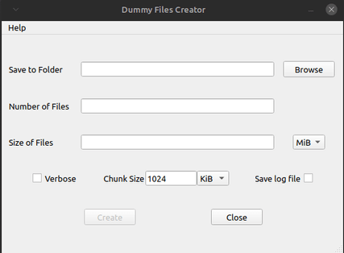
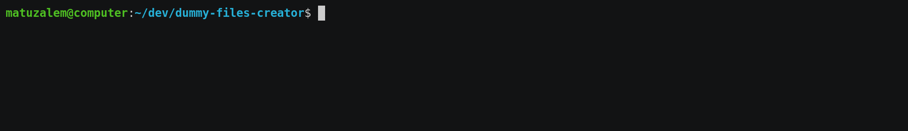

# Dummy Files Creator

 [](https://www.codacy.com/gh/matuzalemmuller/dummy-files-creator/dashboard?utm_source=github.com&amp;utm_medium=referral&amp;utm_content=matuzalemmuller/dummy-files-creator&amp;utm_campaign=Badge_Grade)

Application to generate dummy files with random content and different checksums. **File units are corresponding powers of 2<sup>10</sup> [(KiB, MiB, GiB)](https://en.wikipedia.org/wiki/Orders_of_magnitude_(data))**.

See the project in [GitHub](https://github.com/matuzalemmuller/dummy-files-creator) and [PyPi](https://pypi.org/project/dummyfilescreator/).

For a bash-based (more performant) solution, see [this project](https://github.com/matuzalemmuller/test-files-creator).

## Installation

Pre-compiled packages for Windows are available on the [releases page](https://github.com/matuzalemmuller/dummy-files-creator/releases). Linux and macOS packages may be supported in the future, depending on demand.

### Cross-platform (recommended)

Install via pip:

```sh
pip3 install dummyfilescreator
```

or, install as a local package:

```sh
git clone https://github.com/matuzalemmuller/dummy-files-creator
python3 setup.py install
```

or, don't install, and just run as a regular python program:

```sh
git clone https://github.com/matuzalemmuller/dummy-files-creator
pip3 install -r requirements.txt
python3 dummyfilescreator.py
```

### Windows

Download the latest executable from the [releases page](https://github.com/matuzalemmuller/dummy-files-creator/releases).

*   The build tagged as `windows-dir-x86_64` has a directory with multiple files, one being `dummyfilescreator.exe`, and is faster to start.
*   The build tagged as `windows-one-file-x86_64` has a single executable [but it takes longer to start](https://pyinstaller.org/en/stable/operating-mode.html#bundling-to-one-file).

## Usage

Both GUI and CLI modes are available. Note that CLI mode is recommended for creating large datasets.

### GUI mode

To use the GUI mode, start `dummyfilescreator` without arguments. This mode is **not** recommended for creating large datasets.



### CLI mode

Recommended for creating large datasets. The parameters for CLI mode are listed below.

| Key | Description |
| --- | --- |
| --output / -o | Location where files will be created |
| --n-files / -n | Number of files to be created |
| --size / -fs | Size of files to be created |
| --unit / -fu | Size unit (KiB, MiB, GiB) |
| --chunk-size / -cs | Chunk size |
| --chunk-unit / -cu | Chunk size unit (KiB, MiB, GiB) |
| --log / -l | Saves log file. *Affects performance* |
| --hash / -ha | Includes md5 hash in log file. *Affects performance* |
| --progressbar / -p | Shows progress bar. *Affects performance* |
| --verbose / -v | Shows per-file progress bar. *Affects performance* |

Example:

*   Create 5 files of 80 MiB each, show the individual file creation progress (verbose output), and save the log file with md5 hash to /tmp.

[](https://asciinema.org/a/WN5s9E54sgA0Ftxp0IDA1Zxq3)

```sh
$ dummyfilescreator -o=/tmp -n=5 -fs=80 -fu=MiB -cs=1 -cu=MiB -l=/tmp -ha -v
5 file(s) created in /tmp
Log file saved to /tmp

$ ls /tmp | grep dummy
71bfdea7-f701-40da-97c0-ff0331edd004.dummy
b2c97bc9-159d-41a7-ae8f-55c4d1d2c9ce.dummy
b853d34a-e38d-4f97-8648-9db937ce9a61.dummy
dummy-files-creator.csv
e7149851-0e3a-400f-a929-8ab84b0a0a25.dummy
e9658f26-eb5d-4547-b456-ca2020459f2f.dummy

$ tail -n 1 /tmp/dummy-files-creator.csv
"2022-06-12 22:59:52.213830","80MiB","/tmp/71bfdea7-f701-40da-97c0-ff0331edd004.dummy","442cc4ebbe37cad4025b4bb2049db497"
```
